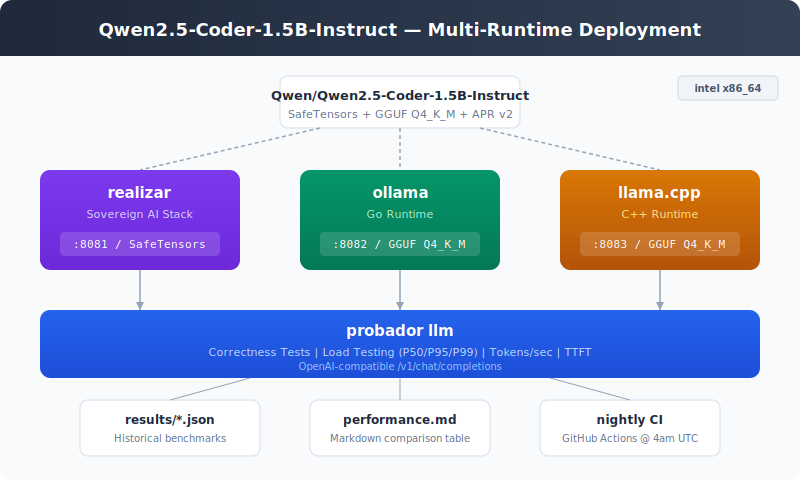

# qwen-coder-deploy

<p align="center">
  
</p>

Deploy and benchmark Qwen2.5-Coder-1.5B-Instruct across realizar, ollama, and llama.cpp.

## Quick Start

```bash
# Deploy all runtimes to intel
make deploy

# Run correctness tests
make test

# Run load tests and generate reports
make load
make report
```

## Runtimes

| Runtime | Port | Model Format | Status |
|---------|------|-------------|--------|
| realizar | 8081 | SafeTensors/APR | Active |
| ollama | 8082 | GGUF Q4_K_M | Active |
| llama.cpp | 8083 | GGUF Q4_K_M | Active |

<!-- PERFORMANCE_START -->
## Performance Results

| Date | Runtime | Concurrency | RPS | P50 (ms) | P95 (ms) | P99 (ms) | TTFT P50 (ms) | Tok/s | Requests |
|------|---------|-------------|-----|----------|----------|----------|---------------|-------|----------|
| 2026-03-01 | realizar-apr | 4 | 0.4 | 12807.2 | 12950.4 | 12963.4 | 12807.2 | 6.9 | 13 |
| 2026-03-01 | realizar-gguf-1 | 4 | 1.5 | 2586.0 | 4155.6 | 4179.1 | 2586.0 | 1.5 | 45 |
| 2026-03-01 | realizar-gguf-2 | 4 | 1.5 | 2510.7 | 3839.4 | 3876.5 | 2510.6 | 1.5 | 45 |

<!-- PERFORMANCE_END -->

## Testing

Correctness tests verify basic capabilities (math, code generation, explanation).
Load tests measure throughput, latency percentiles, and tokens/sec.

All results stored in `results/` and aggregated in `performance.md`.
