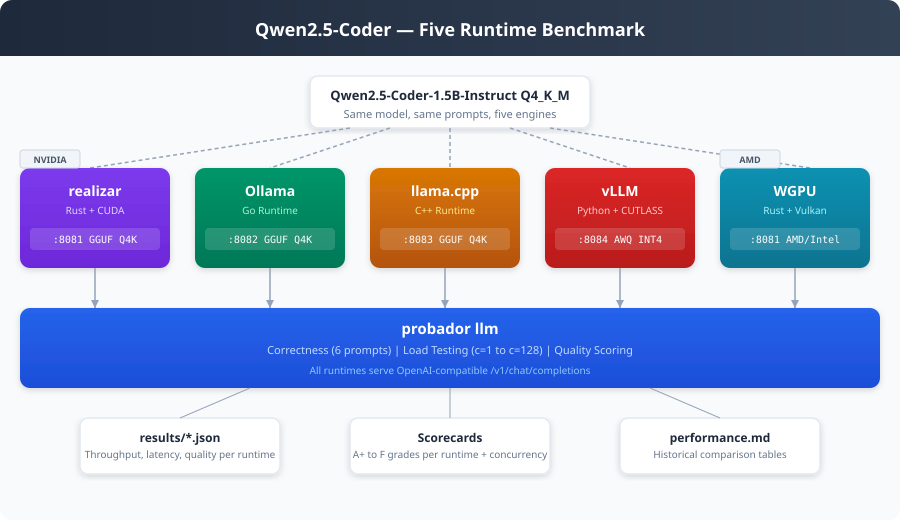

# qwen-coder-deploy

<p align="center">
  
</p>

Deploy and benchmark Qwen2.5-Coder-1.5B-Instruct across realizar, ollama, llama.cpp, and vLLM. All infrastructure managed via [forjar](https://github.com/paiml/forjar). Quantitative scoring via [probador](https://github.com/paiml/probador).

## Quick Start

```bash
# Yoga deployment (PRIMARY — RTX 4060 Laptop, isolated benchmarks)
make bench-yoga-serial       # All 4 runtimes, c=1 and c=4 (short prompt, isolated)
make bench-yoga-prod         # All 4 runtimes, production methodology (medium prompt, c=1-128)
make bench-yoga-prod-realizr # realizr only (c=1-128)
make bench-yoga-prod-vllm    # vLLM only (c=1-128)
make score                   # Generate scorecards (table format)
make score-prod              # Production methodology scorecards only
make teardown-yoga           # Stop all services

# 4090 deployment (deep profiling only — QLoRA training runs full-time)
make deploy-gpu              # Build + start via forjar
make nsys-gpu                # nsys kernel timeline
make ncu-gpu                 # ncu per-kernel roofline

# CPU deployment (intel host)
make deploy                  # Deploy via forjar to 192.168.50.100
make test                    # Correctness tests
make load                    # Load tests
```

## Runtimes

| Runtime | Port | Model Format | GPU |
|---------|------|-------------|-----|
| realizar (Sovereign AI Stack) | 8081 | GGUF Q4_K_M | CUDA (DP4A INT8 + FP8 prefill) |
| ollama | 8082 | GGUF Q4_K_M | CUDA (auto-detected) |
| llama.cpp | 8083 | GGUF Q4_K_M | CUDA (full offload, -ngl 99) |
| vLLM | 8084 | AWQ INT4 | CUDA (PagedAttention, CUTLASS GEMM) |

<!-- PERFORMANCE_START -->
## Performance — RTX 4060 Laptop (2026-03-19, PMAT-276 same-session, locked 1900MHz)

### Production Methodology (medium prompt ~102 tok, uniform:16,256 output, streaming, 60s)

| c | realizr | llama.cpp | vLLM | ollama |
|---|---------|-----------|------|--------|
| 1 | 147.2 | 158.0 | 152.3 | 148.6 |
| 4 | 291.2 | 352.2 | 586.8 | 157.0 |
| 8 | 494.6 | 416.5 | 1,114.4 | 156.6 |
| 16 | 868.8 | 894.4 | 1,983.2 | 156.0 |
| 32 | **1,469.4** | 922.9 | 2,898.5 | 153.0 |
| 64 | **1,484.9** | — | 3,145.8 | — |
| 128 | **1,510.5** | — | 3,162.6 | — |

realizr uses CUDA_MAX_BATCH=32 + ITERATION_SCHEDULER=1. Asymptote **~1,511 tok/s** (+71% vs BATCH=16). 0% errors at all c. All numbers ±1% across sessions.

### Scorecards (probador llm score, PMAT-276 — same-session 4-runtime, B32 iter sched)

| c | realizr | llama.cpp | vLLM | ollama |
|---|---------|-----------|------|--------|
| 1 | 94 A | 93 A | 98 A+ | 77 B |
| 4 | 70 B | 70 B | 98 A+ | 57 C |
| 8 | **76 B** | 66 C+ | 97 A+ | 57 C |
| 16 | **78 B** | 71 B | 94 A | 57 C |
| 32 | **75 B** | 63 C+ | 87 A- | 57 C |
| 64 | 64 C+ | — | 75 B | — |
| 128 | **66 C+** | — | 64 C+ | — |

realizr B32 overtakes llama.cpp at c=8 (76 vs 66) and holds through c=32 (75 vs 63). Quality crossover: realizr **beats** vLLM at c=128 (66 vs 64).

### Asymptotes (PMAT-192/195/197/258)

| Runtime | Asymptote | Architecture |
|---------|-----------|-------------|
| vLLM | **3,163** tok/s | PagedAttention, continuous batching, CUTLASS GEMM |
| realizr | **1,511** tok/s (iter sched, B32) | Iteration scheduler, BATCH=32 |
| llama.cpp | 943 tok/s | Fixed 16 slots, ncols-templated GEMV |
| ollama | 160 tok/s | Serial FIFO |

Iteration scheduler + BATCH=32: asymptote 1,511 tok/s (+71% vs BATCH=16 885). PMAT-221 quality bug eliminated by slot-level recycling.

### Cross-Platform Decode (c=1, isolated, streaming)

| Platform | vLLM | realizr | llama.cpp | ollama |
|----------|------|---------|-----------|--------|
| **RTX 4060L** (24 SMs, 1900MHz) | 153.6 | 149.2 | 159.1 | 160.8 |
| RTX 4090 (128 SMs) | — | 411.7 | 436.9 | — |
| Jetson Orin (8 SMs, MAXN_SUPER) | — | **25.2** | — | — |

*RTX 4060L: PMAT-276 same-session (Mar 19). Jetson: PMAT-278 (Mar 19). Production methodology (medium, uniform:16,256, streaming).*

### Key Findings (PMAT-209→279)

**Architecture characterization (complete):**
- **CUDA graph is only beneficial at c=1** (PMAT-279): +12.2% at c=1, **0% at c≥4** (−0.8% at c=16). Per-M graph value is 100% CPU-GPU pipelining, not launch savings
- **2-factor gap model** (PMAT-277): gap = decode_rate × sched_util, validated within 1%. Decode crossover at c≈64 (realizr 1.98× vLLM at c=128)
- **Per-step pipeline** (PMAT-267): GPU 7.4ms + serving 5.5ms. Graph + event sync → **0.66-0.79× vLLM** (50-80% overlap)
- **TTFT scaling** (PMAT-275): realizr FLAT (35-42ms c≤32), vLLM GRADUAL (12→111ms), llama.cpp LINEAR→CLIFF

**Prompt-sensitivity (3-runtime × 3-profile × c=1→128):**
- **3 structural patterns** (PMAT-268→272): realizr PLATEAU (−24-26%), vLLM CONCAVE (−9%→+18% reversal), llama.cpp INVARIANT (±4%)
- **Competitive ratio shifts** (PMAT-274): realizr/vLLM widens 36% with long prompts. realizr/llama.cpp crossover shifts: wins c=16 short (1.19×), loses c=16 long (0.81×)
- **Fused Q4K GEMM now REQUIRED** (PMAT-268): iter sched increases penalty to −21-26% at c≥16

**Production baselines (PMAT-276, same-session serial isolated):**
- **Iteration scheduler + BATCH=32**: asymptote 1,511 tok/s (+71% vs B16). 0% errors. Quality crossover c=128 (66 > 64 vLLM)
- **Jetson Orin** (PMAT-278): 25.2 tok/s decode (+51% from v0.4.10). Prompt-sensitivity lower (−2.4% vs −4.2% yoga, no FP8)

**Implementation readiness:**
- Phase 1 audit (PMAT-256): ~1,000-1,400 LOC. Paged KV ready, CB is blocker
- Investment priority (PMAT-279 revised): **event sync first** (pipelining) > per-M graph > fused Q4K GEMM > CB > paged KV
- c=1 decomposition: GPU 6.29ms + serving 0.54ms + graph 0.83ms. Serving grows to 6.3ms at c=4

See [performance.md](performance.md) for full history. See [gpu-performance-spec.md](docs/specifications/gpu-performance-spec.md) for detailed analysis.
<!-- PERFORMANCE_END -->

## Infrastructure

| File | Purpose |
|------|---------|
| `forjar-yoga-realizr.yaml` | Yoga realizr deployment (RTX 4060L) |
| `forjar-yoga-llamacpp.yaml` | Yoga llama.cpp deployment |
| `forjar-yoga-ollama.yaml` | Yoga ollama deployment |
| `forjar-yoga-vllm.yaml` | Yoga vLLM deployment |
| `forjar-yoga-teardown.yaml` | Stop all Yoga services |
| `forjar-gpu.yaml` | 4090 deployment (deep profiling) |
| `forjar.yaml` | CPU deployment (intel host, SSH) |
| `prompts/correctness.yaml` | 6-prompt correctness test suite |
| `scripts/nightly.sh` | Automated benchmark pipeline |
| `docs/specifications/gpu-performance-spec.md` | Performance specification (v5.20.0) — [changelog](docs/specifications/gpu-performance-spec.md#14-revision-history) |
| `docs/specifications/scoring.yaml` | Scoring contract v2.0.0 |

## Correctness

All 4 runtimes pass 6/6 correctness tests (math, code gen, explanation, JSON, SQL).

## Testing

Correctness tests verify basic capabilities (math, code generation, explanation).
Load tests measure throughput, latency percentiles, and tokens/sec via `probador llm load`.
Scoring via `probador llm score` with absolute thresholds (decode, TTFT, ITL, tail, errors).

All results stored in `results/` and aggregated in `performance.md`.
